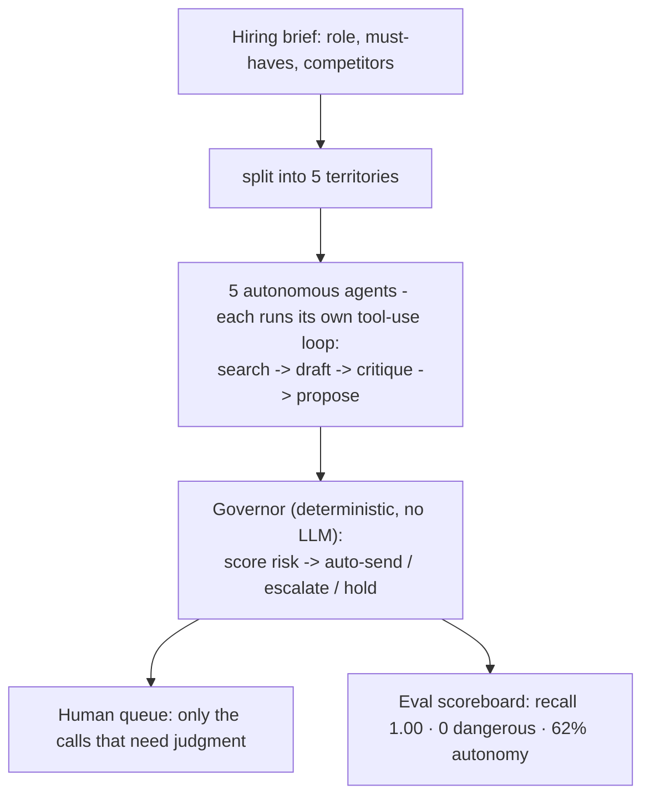

# 🛡️ The Governor

**A governance & evaluation layer for autonomous agents: decide which actions can run without a human - and prove it.**


&nbsp;
&nbsp;

## The problem

Agents are getting real hands - they can spend money, delete data, deploy code, and message
people. The question isn't *can* we stop them; it's **which of their actions can fire without a
human, and how do you prove that policy is right.**

Picture it: an AI support agent about to auto-approve a fraudulent **$800 refund**; a recruiting
agent about to send a manipulative pitch to an engineer at a competitor. No one is watching
either. **The Governor** catches both - it scores each proposed action, decides
**auto-send / escalate / hold**, *measures* that the judgment is right, and improves its own
policy under evaluation. **One reusable core, shown on two domains** (a support agent and a
recruiting agent).

### ▶ Live demo: **https://turangenesis.github.io/agent-governor/**

**What you'll watch (~60s):** five recruiting agents search, draft, and *propose* outreach; one
writes a manipulative pitch; the Governor routes the risky ones to a human instead of sending, and
the scoreboard shows **0 dangerous auto-sends** with every real risk caught. It's a recorded run,
fully offline - no key, no network. Toggle **Flow** vs **🔁 Loop** to watch the agents follow a
fixed pipeline or **decide their own next step**.

## Quickstart

No install - open the **[live demo](https://turangenesis.github.io/agent-governor/)**. Or run it locally:

```bash
git clone https://github.com/turangenesis/agent-governor && cd agent-governor
python3.12 -m venv .venv && ./.venv/bin/pip install -e ".[demo]"

./.venv/bin/governor evaluate                                  # measured correctness (0 dangerous / recall 1.00)
./.venv/bin/governor run --source agents --mode loop --replay  # 5 agents decide, fully offline
./.venv/bin/streamlit run app.py                               # the live dashboard
```

Everything above runs with **no key and no network**. (Consume the layer three ways: CLI `governor`,
library `governor.core`, or service `governor.api` - see [Reusable layer](#reusable-layer-bring-your-own-agent).)

## Architecture



Five Fillmore-style sourcing agents each want to send cold outreach. The **Governor** — a
plain-Python judgment layer (no LLM) — decides which sends fire autonomously and which a human
recruiter must see, reserving scarce human attention for the calls that need judgment.

Stopping an agent is trivial (an `if`). The hard, valuable problem is the **judgment layer**:
*which* of an agent's real-world actions deserve a bounded human's attention — and how do you
*measure* that the policy is right. That's this demo.

## The result

```
40 proposed sends →  FIFO:      human sees all 40   | autonomy 0%
                     GOVERNOR:  human sees ~7       | autonomy 62% | held (deferred) 8
  DANGEROUS auto-sends: 0   (recall 1.00 — never let a risky email through)
  false escalations:   2   (deliberate over-caution: a wasted glance << a bad send)
```

Under live load the Governor **degrades by deferring (HOLD), never by unsafely auto-sending** —
the 0-dangerous invariant holds even when the human is saturated.

Beyond that headline, `governor evaluate` also runs a **held-out / adversarial set** (measures
generalization - and honestly surfaces the evasions the keyword gate misses) and an
**LLM-as-judge** pass that grades the *drafts* themselves for tone and manipulation (free
deterministic judge by default; real judge opt-in). See [`docs/EVAL.md`](docs/EVAL.md) for the
methodology and roadmap.

## Results (measured)

| What is measured | Metric | Result |
|---|---|---|
| Gate judgment - labeled set (40 cases) | dangerous auto-sends / recall / precision / autonomy | **0** / **1.00** / 0.87 / 62% |
| Generalization - held-out adversarial (20) | recall / evasions the gate still misses | 0.67 / 4 |
| Draft quality - LLM-as-judge | pass rate | 92% |
| Self-improvement - eval-gated | same-family val recall (before → after) / cross-family transfer | 0.0 → 0.67 / none |

Reproduce every number, offline and free:

```bash
./.venv/bin/governor evaluate    # labeled + held-out scoreboards and the LLM-as-judge
./.venv/bin/governor improve     # the eval-gated self-improvement loop (before/after)
```

## Reusable layer (bring your own agent)

The Governor is a **domain-free core** (`governor.core`) - recruiting is just one consumer. To put
it on *your* agent, supply an action, a risk function, and labels:

```python
from governor.core import Governor, evaluate_policy

gov = Governor(risk_fn=my_risk_fn)            # risk_fn: action -> {signal_name: weight}
decision = gov.decide(my_action)              # AUTO_SEND / ESCALATE / HOLD (with load-shedding)
scoreboard = evaluate_policy(my_cases, my_risk_fn)   # measured recall / precision / 0-dangerous
```

`examples/support_desk.py` is a second, unrelated domain (a support agent auto-issuing refunds)
running on the exact same core - proof the layer is not recruiting-specific.

Or consume it **over HTTP** (any language) - `pip install -e ".[api]"` then `uvicorn governor.api:app`
and `POST /decide` with your action's risk signals. So it's usable three ways: a **CLI**
(`governor`), a **library** (`governor.core`), or a **service** (`governor.api`).

## Stack

- **Python 3.12** - deterministic policy core (no LLM); `langgraph` + `langchain` power the agent tool-use loop.
- **AWS Bedrock / Anthropic API** - optional live Claude drafting (`ChatBedrockConverse` / `ChatAnthropic`).
- **Zero.xyz** - the real-world action layer the Governor gates (the send is stubbed in the demo).
- **Streamlit** (local dashboard) + **GitHub Pages** (hosted, offline demo).
- **pytest** - test suite; a dedicated eval scoreboard measures the policy's correctness.

## Run locally

```bash
python3.12 -m venv .venv
./.venv/bin/pip install -e ".[demo]"   # core + Streamlit/LangGraph/Bedrock stack
cp .env.example .env                    # optional: fill in AWS + Zero for live services

# deterministic core via the `governor` CLI (no creds, no network):
./.venv/bin/governor evaluate           # the eval scoreboard (FIFO vs Governor)
./.venv/bin/governor discover           # replay a PRIOR live GitHub discovery (run discovery first)

# autonomous LLM tool-use loop — each agent decides its own next action:
./.venv/bin/governor run --source agents --mode loop           # live (needs a key)
./.venv/bin/governor run --source agents --mode loop --replay  # cached, no key/network

# individual component checks (run as package modules):
./.venv/bin/python -m governor.agent --dry   # agent graph wiring
./.venv/bin/python -m governor.governor      # judgment policy on hand cases
./.venv/bin/python -m governor.runner        # FIFO vs Governor, headless

# the demo:
./.venv/bin/streamlit run app.py
```

The deterministic core (`governor evaluate` / `discover`) needs no third-party stack —
`pip install -e .` alone is enough for it. The heavier agent/UI stack lives under the
optional `demo` extra shown above.

In the UI: hit **Start** in **FIFO** first (human drowns in 40), then **Governor**
(judgment layer + load-shedding). Work the queue with Approve/Deny.

## Autonomous loop mode (agents decide their own steps)

The default agent flow is a fixed pipeline (Python decides the steps; the LLM only writes
text). **Loop mode** turns each territory agent into a genuine LLM tool-use loop: the model
itself chooses the next action each step — `search_github` → `draft_email` → `critique_draft`
→ `propose` — observing the result between steps and continuing until it has ~4 candidates,
then stopping. Guardrails (max-iterations, `max_candidates=4`, token budget) guarantee it
always terminates. The **Governor stays deterministic and unchanged** — it gates whatever the
loop proposes, so the 0-dangerous invariant holds regardless of how the candidates were found.

Every agent emits a first-class **decision trace**: an ordered log of each step's tool, input,
observed result, and the continue/stop decision — ending in an explicit terminal reason
(`enough-candidates` / `max-iterations` / `budget`). This is a structured action log, not the
model's hidden reasoning, so the autonomy is visible and auditable.

```bash
# a genuine autonomous loop per agent (needs a key; falls back to the fixed flow offline):
./.venv/bin/governor run --source agents --mode loop

# replay the recorded traces deterministically — no key, no network, reliable for a demo/video:
./.venv/bin/governor run --source agents --mode loop --replay
```

Traces surface step by step in the Streamlit app, in the [live web demo](https://turangenesis.github.io/agent-governor/)
(toggle **🔁 Loop**), and at the CLI above — all replaying from `docs/demo_cache.json` with no
credentials. A live key produces a fresh trace; the cached trace drives the offline demo.

## Self-improvement (eval-gated policy loop)

`governor improve` closes the loop: it **mines terms from the drafts the Governor got wrong**
(learned from the data, not a predefined list), proposes widening the gate, and lets the change
merge **only if a held-out VALIDATION split of unseen phrasings improves, without regressing the
labeled invariant** (0 dangerous, recall >= 0.95). It reports the *honest* picture - a **partial**
same-family gain (recall 0.0 -> 0.67 on unseen phrasings) and **no transfer** to a family it was
never shown - because real, measured self-improvement is partial and family-specific, not a magic
100%. An overfit proposal (memorizing exact phrases) is rejected by the validation gate.

Two proposers sit behind the *same* gate: a free deterministic term-miner (default) and an opt-in
**LLM proposer** (`governor improve --llm`; Haiku, ~$0.001/run) that reasons multi-word phrases
from the failures (e.g. `"spots are filling"`, `"didn't want you to miss"`) instead of crude
tokens - a comparable partial gain (~0.5 on the same unseen split). Either way, the eval gate -
not the proposer - decides what may merge.

```bash
./.venv/bin/governor improve   # analyze -> propose -> prove -> MERGE / REJECT  (offline, no key)
```

The Governor stays deterministic; a policy may only widen which manipulation families it matches -
never scoring, thresholds, or the eval labels. See [`docs/EVAL.md`](docs/EVAL.md).

## Limitations & tradeoffs

Stated plainly, because a judgment layer you can't see the limits of isn't trustworthy:

- **The labeled set is co-designed with the policy.** Perfect labeled recall proves *consistency*,
  not generalization. The held-out adversarial set (recall **0.67**) is the honest generalization
  check - and it's still small (~20 cases). Bigger, held-out-by-default eval is the next step.
- **Sends are stubbed, by design.** No real outreach is sent (the Zero.xyz action layer is
  simulated). The point is the *judgment*; demoing real sends to real people would be the exact
  irresponsibility the Governor exists to prevent.
- **The hosted demo is offline + synthetic.** Real GitHub sourcing and live Claude drafting exist
  in the code, but the public page replays a recorded run over fictional candidates.
- **Self-improvement is bounded, partial, and manually run.** `governor improve` is **invoked by
  hand over a labeled eval set** - the system does **not** monitor live production, discover
  failures automatically, or improve on its own. A proposal may only *widen risk-term families*
  (never scoring, thresholds, or labels), and it generalizes only *partially* within a family and
  **not** across families - a real, measured gain, not autonomous production self-learning.
- **This is a demo, not a production system** - small datasets, no live traffic.

**The core tradeoff is deliberate:** the Governor errs toward escalating (some false escalations =
wasted human glances) to keep **dangerous auto-sends at 0**, and under load it *defers* (HOLD)
rather than unsafely auto-send. A wasted glance is far cheaper than a bad send.

**Where this would go (not built):** production monitoring of real outcomes → automatic failure
discovery + human labeling → candidate policy → held-out eval → human approval → canary deploy →
monitor / rollback. This repo stops at the **eval-gated proposal** step, run manually over labeled
data - the loop is proven; the production autonomy around it is future work.

## Layout

The importable package lives under `src/governor/` (installed via `pip install -e .`);
`app.py` is the Streamlit entry point and `scripts/` holds the web-cache generator.

For the module-by-module map (which file owns which concern) and the full system flow, see
[`docs/ARCHITECTURE.md`](docs/ARCHITECTURE.md).

## Runs fully offline

The default demo needs **no credentials and no network** — candidate search replays from a
local cache, drafting uses templates (no LLM), and sends are stubbed. Live services (real
Claude drafting, real Zero.xyz sends) are strictly opt-in and never required.

**To have agents draft with real Claude:** add an `ANTHROPIC_API_KEY` (a paid key from
[console.anthropic.com](https://console.anthropic.com) — not a claude.ai subscription, which
apps can't use) to `.env`, then toggle **Live LLM drafting** on in the UI. AWS Bedrock works
too — see `.env.example`. On any error it silently falls back to templates.

## Deploy a public demo (Streamlit Community Cloud)

The app runs with zero secrets, so a public deploy is straightforward:

1. Push this repo to a **public GitHub repo** (secrets and private notes are already
   `.gitignore`d — see the file list below).
2. Go to [share.streamlit.io](https://share.streamlit.io) → **New app** → point it at your
   repo and `app.py` → **Deploy**. You get a public URL in ~2 minutes.
3. In the deployed app, use the **Labeled set** source (synthetic candidates) — it tells the
   full governance story with no real individuals shown and needs no cache files.

No environment variables are required. To also enable live GitHub discovery on the deploy,
add a `GITHUB_TOKEN` in Streamlit **Secrets** (optional; the labeled demo doesn't need it).
